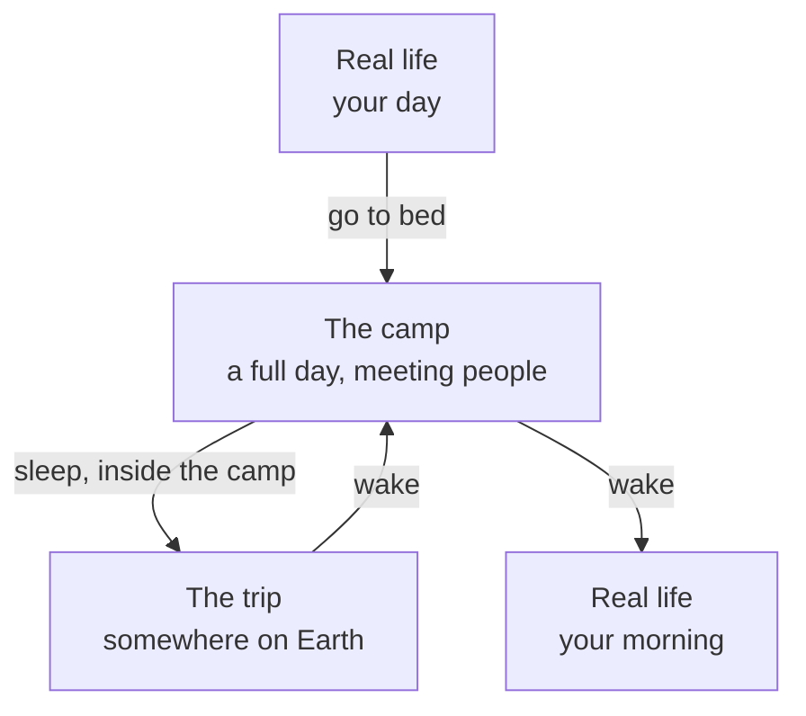

# One Earth Day. Two Days of Life.

**A framework for using the hours we sleep.**

You decide what you dream — where you go, how long you stay, and whether anyone comes with you at all. When you do want people, it rests on one claim: **there is no better way to know a person than spending time with them.**

---

### This is a draft for discussion, not a specification

The ten open questions at the end are the point, not the gaps. Several of them could change the whole shape of this, and I don't want to answer them alone.

**Each open question is an [issue](../../issues). Argue there.** Disagreement is more useful to me than agreement.

A live version you can comment on inline, sentence by sentence, is here: **[One Earth Day. Two Days of Life.](https://claude.ai/code/artifact/5cc72132-7801-4c10-aeb9-24bf5d395706)**

Nothing has been built. That is the invitation.

---

# Part One — The framework

## The idea

Every night your body needs eight hours and your mind does not.

The camp is a place you wake up in when you go to sleep. You live a day there, and you can spend it meeting people. At the end of that day you sleep again, and go somewhere on Earth you have never been — with whoever you chose, or with nobody. Then you wake up at home.

One Earth day. Two days of life.

## Why

The world is becoming less and less physically connected. People work alone, live alone, and move less. So much of ordinary life now quietly prevents us from doing, going, and meeting the things and people we actually want.

Everything built to fix that online hands you a shortcut. A profile to read. A message to send. A feed to judge someone from. Every one of them is a way of learning *about* a person.

There is no substitute for spending time with someone. Not a summary of them — the hours. What they want to do with an evening. What they notice. What they are like when the plan changes, or on a long drive when nobody is performing.

So the product is not a profile. It is the evening.

Meanwhile the hours before sleep are the ones we most reliably waste: private, unstructured, almost universally spent alone with a screen. Reclaim them. Not with more content. With people.

## Who it's for

Anyone who wants a new connection, and that is deliberately broad: a friend, a partner, a collaborator, a co-founder, someone to talk to. The camp never asks what you are looking for and never steers you toward it.

It is also for people whose real life currently makes meeting anyone hard. Meeting people physically costs money, mobility, time, and often looking or sounding a certain way. If you are broke, ill, housebound, newly arrived somewhere, or simply in a bad stretch, those gates are closed.

The camp has none of them. You arrive under a name that is not yours. Nobody knows your job, your money, your body, or what kind of year you are having. They know what you show them — which is rule six, and why it is a rule and not a setting.

## You don't have to want people

Forming a team is a choice, not a requirement. The camp asks nothing of you.

If you are simply tired, go alone. Choose the place, choose how long, and spend the night somewhere quiet with nobody in it. That is a complete use of this — relief, not a consolation prize for failing to make friends.

And if the people you want are already in your life, bring them. A married couple, a family, a group of old friends can form their own circle and keep it closed — the same people every night, going wherever they like. You never have to meet a stranger to use your nights. You can spend them with people you already love, somewhere none of you could otherwise afford to go, and accumulate far more time together than a working week would ever allow.

A circle changes what some of the rules mean, and the framework should say so rather than pretend otherwise. People who already know each other have nothing to reveal and no reason to keep rule four — they can simply text each other in the morning. The camp's consent machinery exists to protect strangers from one another; inside a closed circle it sits idle. That may be perfectly fine. It may also mean circles want a lighter camp than strangers do.

So there are three ways to spend a night, and none of them is the real one:

- **Alone**, for rest.
- **With people you already have.**
- **With people you are still deciding about.**

What connects all three is the same freedom: you decide what you dream. Where, with whom, for how long, and whether anything is asked of you at all.

## The three layers

Sleep is a door, and it works the same way at every level.

Inside the camp you have a whole day: classes, cafés, meeting people. You choose tonight's team, and you choose where you will sleep. Then you sleep again, and the trip is that night.

The layers are not all lived the same way, and this matters. **The camp's day is asynchronous** — you dip into it across your own waking hours: a few minutes in a café, a message in the planning room, the walk to a new house. **Only the trip is live**, at one fixed hour each evening, with your whole team present at once. So the camp is a day you live in fragments, and the night is an hour you live together.

The camp persists. Tomorrow night it is the next camp-day — same room, same luggage, the same people one day older. A parallel life, running at one camp-day per real night.

So if you skip a night, the camp goes on without you. You return having missed a day. People moved. A group formed without you. Nobody had to design that as a penalty; it falls out of the structure.

## What the extra day is for

The arithmetic is simple, and it is the whole ambition. Two days of life per Earth day is 730 days a year instead of 365.

What that buys is time with people, which is the scarce input to almost everything. A couple trying to work out whether this is it currently just have to wait — real life doles out evenings and weekends. Here they could spend two hundred days together in one hundred, and know sooner. It is not only couples: anyone deciding whether to trust someone, work with someone, or build something with them is mostly just waiting for hours to accumulate.

Scale that up and the claim gets bigger. If people generally had twice the lived time, and spent it meeting, deciding and understanding each other, the world would move faster — because a great deal of what slows us down is the wait for people to know each other well enough to act.

That is the far end of the thesis. It is stated here as an ambition, not a finding.

One caveat, since the couple is the sharpest version of it: a day in the camp is a day without money trouble, chores, illness or logistics. You learn an enormous amount about a person — but you learn the good-weather version of them. Friction is where a lot of the information lives, and the camp has none. Accelerating a decision on 730 frictionless days is not the same as making it on 365 real ones. Worth knowing before anyone marries on it.

## Two kinds of belonging

This is the load-bearing idea.

> **Your team is who you make new memories with.
> Your house is who you let see your old ones.**

Your team travels with you at night. Public. Joined slowly and mutually — you cannot simply attach yourself to a group; they have to want you too, and that takes days of cafés and near-misses before anyone commits.

Your house is where you sleep inside the camp. Private. Chosen freely, at the cost of carrying everything you own across camp, in front of everyone.

They are different people and they do not have to overlap. You can sleep beside someone you will never travel with. That is not redundancy — it is two opposite ways of knowing a person, and you get both.

Your luggage holds six or eight things from your real life, from before any of this. They never change. What changes is how much of each one you have let out: seen on a shelf, then asked about, then the actual story. Real intimacy is not gathering new history together. It is slowly admitting the history you already had.

## Rule four

The camp posts its rules and does not explain them. The fourth is:

> **You may not say where you slept.**

You arrive under a name that is not yours. Your real identity is revealed only when two people both choose to reveal it — which is what a season quietly climbs toward. But your luggage is true, and your housemates can see it.

So where you slept is not information about a bed. It is proof of intimacy that bypassed consent — evidence of who you let look at you before you had agreed to be known. It is the one piece of information that routes around the whole system.

A season does not end with a score. It ends with a list of the people you decided to be real with.

## You can leave whenever you want

There is no cost to quitting and there never will be. No streak to break, no penalty, no screen engineered to make you hesitate. If you meet someone in your real life and you would rather spend your evenings with them, go. If you are tired of it, go. If it stops being worth the hour, go.

This is a commitment, not a courtesy.

Everything else built for the hours before sleep is built to keep you there, and most of it works by making leaving feel expensive. This is for a disconnected world, which means its success condition is that people eventually stop needing it. A camp nobody leaves has failed at the only thing it claimed to do.

## What this is not

- **Not a metaverse.** No persistent world to move into. Nothing for sale, nothing accumulating.
- **Not a dating app, and not a professional network.** The goal is knowing people, not matching with them. Friendship, love, work, collaboration — the camp does not ask which and does not optimise toward any of them.
- **Not escapism.** The claim is you come back with more than you left with. If people finish lonelier, this has failed on its own terms.
- **Not a game you win.** No score. You end with who you chose to be real with.

## Open questions

Real problems, not placeholders. Several could change the whole shape. **This is the part that needs other people — each one is an [issue](../../issues).**

1. **What does a long night cost?** Time inside the trip is elastic — the same real hour buys a short dinner or a full day. Duration is intimacy, so free duration means everyone always maxes it. What is the constraint?
2. **What comes back with you?** The premise promises you return more effective in your life. Right now nothing crosses from the trip into the camp, or the camp into your real day. The largest unpaid promise here.
3. **Should anything in the camp be hard?** The camp removes money, chores, illness and logistics on purpose — that is exactly what lets someone whose real life has shut them out arrive as an equal. But it means you only ever meet people in good weather, and friction is where much of what you need to know about a person shows up. Does the camp need something that can go wrong, cost something, or oblige one person to be inconvenienced for another? Or would adding friction close the very gates this was built to open?
4. **Free exit versus continuity.** The camp needs people to show up night after night, and we have guaranteed there is no cost to leaving. How do you build something that depends on presence while refusing to charge for absence?
5. **If nobody has to socialise, why is there a camp?** Going alone and going with people you already know are first-class uses. But someone who only ever wants those does not need a camp, a timetable, a house or a luggage rule — they need a destination menu. What holds the place together once its social core is optional?
6. **What actually happens in a class?** Forced rotation is the purpose. The activity is undesigned.
7. **How long is a season?** Long enough that a mutual reveal is earned, short enough that people finish.
8. **What is a house for?** You do not travel with your housemates. So what is the hour before sleep actually for?
9. **One camp or many?** A single camp of twelve is intimate and fragile. Many cohorts is robust and anonymous. Different products.
10. **Is there a fourth layer?** Nothing prevents sleeping inside the trip. Elegant, or a trick?

### Two more that are unresolved on purpose

**Who pays.** There is nothing in here about funding or price, and what is proposed — 3D multiplayer with spatial voice and a photographic destination pipeline — is expensive infrastructure. I do not have an answer I believe in yet. Tell me what you would do.

**Safety.** The commitments below state values, not mechanisms. There is no age floor here, no reporting flow, no recording policy, no blocking design. For something deliberately built to make strangers open up in private at the most unguarded hour of their day, that gap is the one I am least comfortable with.

---

# Part Two — The detail

## A day in the camp

An ordinary life with everything except connection stripped out. No work, no commute, no obligations. The timetable does two different jobs on purpose.

| Slot | Who | Purpose |
| --- | --- | --- |
| Classes | People you did not choose | Forced rotation — the camp keeps putting strangers in front of you |
| Cafés, open hours | Anyone | Scouting. No commitment. New groups get seeded here |
| Planning | Your team, closed | Agree tonight: where, how you travel, how long |
| The walk | You, alone, in public | Changing house means carrying your things there |
| Sleep | Your team | The trip |

Cafés are where you find people. Planning is where you commit to the people you already have. The person you met at lunch is not in the room when your team decides the night — and that gap is where most of the camp's tension lives.

Classes exist to stop the map from settling. Any group of strangers calcifies within days. Forced rotation is the only reason someone outside a formed clique gets another chance.

## The trip

Decided together, during the camp's day.

**Where.** Anywhere on Earth. People tend to choose what their real lives lack — inland people reach for the sea.

**How you travel.** Not cosmetic. A road trip says *I want the hours with you.* A teleport says *I want to be somewhere I have never been.* Walking says something else again. The vehicle encodes what you came for.

**How long.** Elastic. A three-hour dinner or a full day from morning to dark, for the same real hour.

The trip is a space you move around in, not a chat room — and that is load-bearing. A chat room only ever has one conversation. A space lets the group split: two people drift toward the rocks while the others stay at the table. That drift is how people actually come to know each other. It also means you can be overheard, which is how rule four gets broken.

## The six rules

Posted. Numbered. Unexplained.

1. The timetable is not negotiable.
2. You sleep where you choose. Your things sleep with you.
3. Your team decides the night together.
4. You may not say where you slept.
5. You leave the night when the night ends.
6. What you show, you choose.

## Commitments

Five positions this framework takes deliberately, and would need good arguments to abandon.

**Honest about why, silent about how.** The camp states plainly what it is for, so nobody feels tricked about what they joined. But the rules themselves are simply given. This is not coyness — it is the only neutral thing strangers have to talk about before they are ready to talk about themselves. *What do you think rule four is for?* is a question a shy person can ask on day one. Self-disclosure is a terrible icebreaker; a shared puzzle is a great one.

**The mystery has no answer.** If the camp secretly hides something, this becomes a thriller with extra steps and there will be permanent pressure to reveal it. The strangeness is texture, like weather.

**The camp is strange; the operator is not.** Total silence inside the fiction. Total plain-language clarity outside it — what is recorded, who can see you, how to leave, how to report someone — stated flatly and never in character. Keep those registers apart and ambiguity is pleasurable. Blur them and this hurts people.

**Nobody is exposed without saying so twice.** Identity and anything identifying moves only by mutual consent. This system is designed to make strangers open up in private at the most unguarded hour of their day. That obligates the design, not the terms of service.

**Leaving is always free.** The commitment most likely to be quietly eroded later, which is why it is written down now.

## An honest note on "two days in one"

The fiction says you live two days, and the fiction should stay.

But a public document should separate the claim from the frame. Nobody gains a literal second life. What is actually on offer is an hour before bed, spent with real people, in a structure designed to make that hour go somewhere — instead of the hour nearly all of us currently spend alone with a screen.

Smaller claim. True one. Still worth building.

## Prior art

Worth reading before you tell me this exists already — I went looking, and the closest things are all missing the same piece.

- **[Prophetic](https://www.cnbc.com/2023/10/04/ai-startup-prophetic-aims-to-build-headset-that-lets-you-control-dreams.html)** — a neurostimulation headband pitched explicitly as working while you sleep. Same reclaim-the-eight-hours thesis. Solo productivity via hardware; no people, no shared place.
- **[REMspace](https://www.businesswire.com/news/home/20241008878282/en/Breakthrough-from-REMspace-First-Ever-Communication-Between-People-in-Dreams)** — claims the first word passed between two lucid dreamers, with a stated roadmap toward multi-person dream networks. Neurotech chasing a signal, with no social design behind it.
- **[VRChat sleep rooms](https://www.technologyreview.com/2023/03/29/1070494/vr-sleep-rooms/)** — the most important precedent. Thousands of people already fall asleep next to strangers in virtual campsites, explicitly because of loneliness. Demand, demonstrated, with no design at all.
- **[MIT's Dormio](https://news.mit.edu/2020/targeted-dream-incubation-dormio-mit-media-lab-0721)** — targeted dream incubation. Audio cues during hypnagogia measurably steer dream content. Real science, small scale.
- 360° VR travel is a mature category. *Inception*, *Paprika* and Persona's daily cycle cover pieces of the fiction.

**Nobody has published the social architecture.** Prophetic has hardware and no people. REMspace has a signal and no world. VRChat has behaviour and no design. VR tourism has places and no one in them.

And the strategic point: this needs no neurotech. It does not claim to enter real dreams, so it can be built with today's tools.

## Where this came from

A dream, on the night of 22 September 2026. The dreamer woke at midnight to write it down.

The dream got the hard parts right: two overlapping social graphs, friction on movement, consent-gated identity, nested layers of sleep, and a secrecy rule whose reason only surfaced hours later, when it turned out to be the load-bearing wall.

Nothing has been built. That is the invitation.
