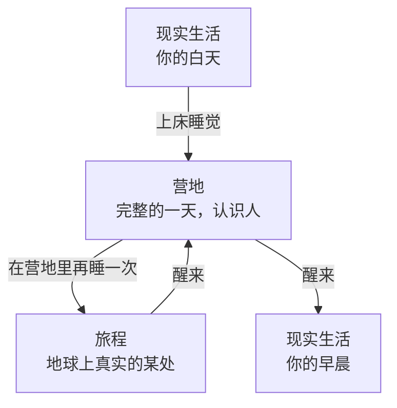

[English](README.md) · **中文**

# 一个地球日，两天人生

**一套关于如何使用我们睡着的那几个小时的框架。**

作者 **Lee Nee Jie（李弥杰）** · 采用 [CC BY 4.0](LICENSE) 授权 —— 可以分享、翻译、在其之上继续做；请署名作者。

你决定你做什么梦——去哪、待多久、要不要有人同行。当你确实想要人的时候，它建立在一个判断上：**要认识一个人，没有比和他一起度过时间更好的办法。**

---

### 这是一份讨论稿，不是规格书

最后那十个开放问题才是重点，不是漏洞。其中好几个足以改变整件事的形状，而我不想一个人把它们想完。

**每一个开放问题都是一个 [issue](../../issues)，请直接去上面吵。** 反对意见对我比赞同有用得多。中文英文都可以——不要另开一套中文 issue，讨论分开就没意义了。

可以逐句评论的在线版本：**[一个地球日，两天人生](https://claude.ai/code/artifact/5cc72132-7801-4c10-aeb9-24bf5d395706)**

什么都还没有做出来。这就是邀请。

—— **Lee Nee Jie**，2026

---

# 第一部分 — 框架

## 这是什么

每天晚上，你的身体需要八小时，你的脑子不需要。

营地是一个你入睡之后醒来的地方。你在那里过完一整天，可以用这一天去认识人。那天结束时你再睡一次，然后去地球上你从没去过的某个地方——和你选的人，或者谁都不带。然后你在家里醒来。

一个地球日，两天人生。

## 为什么

这个世界在物理层面上越来越不连接。人们独自工作、独自生活、越来越少走动。生活里太多东西，在悄悄地让我们没法去做、没法去到、没法遇见我们真正想要的人和事。

而所有想在线上解决这件事的产品，给你的都是捷径：一份可以翻的资料、一条可以发的消息、一个可以拿来判断别人的信息流。它们都只是让你「了解关于一个人的信息」。

和一个人相处的时间，是没有替代品的。不是他的简介——是那些小时。他想怎么过一个晚上。他会注意到什么。计划被打乱时他是什么样，在没人需要表演的长途车上他会说什么。

所以这个产品不是一份资料，是那个晚上。

而睡前那几个小时，恰恰是我们最稳定浪费掉的时间——私密、没有结构，几乎所有人都是一个人对着屏幕度过。把它拿回来。不是用更多内容，是用人。

## 给谁用

任何想要一段新关系的人，范围是故意放得很宽的：朋友、伴侣、合作者、联合创始人、一个可以说话的人。营地从不问你在找什么，也不会把你往哪个方向推。

它也给那些现实生活正让「认识人」变得很难的人。在物理世界认识人是要花钱、要能走动、要有时间的，还常常要你长成或听起来是某个样子。如果你现在手头紧、生病、出不了门、刚搬到一个陌生地方，或者只是正处在一段不好过的日子里，那些门就是关着的。

营地一个门槛都没有。你用的不是你自己的名字。没人知道你的工作、你的存款、你的身体，或者你今年过得怎么样。他们只知道你给他们看的东西——这就是第六条规则，也是为什么它是规则，而不是一个设置项。

## 你不是非得想要人

组队是一种选择，不是要求。营地对你没有任何要求。

如果你只是累了，就一个人去。选地方、选多久，在一个没有别人的地方安静地过一夜。这是一种完整的用法——是休息，不是「交不到朋友」的安慰奖。

如果你想要的人本来就在你的生活里，就把他们带上。一对夫妻、一家人、一群老朋友，可以组成自己的小圈子并且一直关着门——每天晚上都是同样的人，想去哪去哪。你永远不需要认识陌生人才能用你的夜晚。你可以和你已经爱的人一起度过，去一个你们谁都负担不起的地方，累积出远超一个工作周所能给你们的时间。

小圈子会改变一部分规则的意义，框架应该把这一点说出来，而不是假装没这回事。本来就认识的人之间没有什么可揭开的，也没有理由遵守第四条规则——他们早上发个消息就行了。营地那套同意机制是用来保护陌生人之间的；在一个关着门的小圈子里，它基本是空转的。这也许完全没问题。也可能意味着：小圈子需要的是一个比陌生人更轻的营地。

所以有三种过夜的方式，没有哪一种才是「正确的」：

- **一个人**，为了休息。
- **和你已经有的人。**
- **和你还在判断的人。**

把这三种连起来的是同一种自由：你决定你做什么梦。去哪、和谁、多久，以及是不是需要对谁负责。

## 三层结构

睡觉是一道门，每一层都一样。

在营地里你有一整天：上课、咖啡馆、认识人。你选今晚的队友，也选今晚睡在哪。然后你再睡一次，旅程就是那一夜。

三层的活法是不一样的，这一点很重要。**营地的白天是异步的**——你在自己清醒的时间里零碎地进去：在咖啡馆待几分钟、在计划室里留一条消息、搬去新住处的那段路。**只有旅程是实时的**，每天傍晚固定的一个小时，你的队友全部同时在场。所以营地是一个你分成碎片过的白天，夜晚是你们一起过的一个小时。

营地是持续存在的。明天晚上就是营地的第二天——同一个房间、同样的行李、同样的人老了一天。一段平行的人生，以「一个现实夜晚 = 一个营地白天」的速度走。

所以你要是缺了一晚，营地不会等你。你回来时就是少过了一天。有人搬了家，有人组了队，而你不在。没人需要把这设计成惩罚，它是结构本身带出来的。

## 一天，和四个夜晚

上面写的都是结构。下面是从里面看，它长什么样。

### 营地里的一天

你在自己房间里醒来。行李还在原处，因为你昨晚没有搬。

上午有一堂课，人不是你选的。今天是三个你从没说过话的人——其中一个你在咖啡馆注意过，但一直找不到搭话的方式。现在你们在同一个房间里待二十分钟，而且手上有事情要做。

午饭时间不分配任何人。你坐到了她旁边。

然后是你队伍的计划时间，闭门的，她不在里面。你们三个在吵：一个想去城市，一个想去一个没有人的地方，一个无所谓，只要前面有一段长途车。最后定了一条海边公路。

下课以后，你做了一件犹豫了好几天的事——你搬家。你当着还没回去的人，把全部东西搬过整个营地。有人在看。没有人问。他们不被允许问。

然后天黑了，你们出发。

### 四个夜晚

**四个人，三个小时。** 他们是在一个星期的午饭里认识的。他们在黄昏开上一条海边公路，在悬崖边上吃饭，看着光一点点落下去。其中一个人点菜比其他人强得多。营地的午夜之前他们就回来了，比出发时多知道了彼此一点。

**一个人，两个小时。** 她现实生活里很累。她选了日本北部一片冬天的海滩，不带任何人，然后走了一遍。什么都没发生。然后她睡了。这是对一个夜晚完整的使用，不是失败的使用。

**一家人，一整天。** 妈妈在槟城，儿子在墨尔本，妹妹在台北。同一个夜晚，同一个湖，从天亮到天黑，没有人看表。他们拿到的从容时间，比这一整年给他们的都多。

**两个人，绕远路。** 他们已经互相绕了九个夜晚。他们本来可以瞬移。但其中一个选了六小时的火车，而且把这个选择说了出来，另一个人完全听懂了那是什么意思。一路上没别的事做，只能说话，看风景往后退。

最后这一个，就是整个设计的一句话版本：交通工具说出了那个人说不出口的事。

## 多出来的那一天是拿来干嘛的

算术很简单，而这就是全部的野心：一个地球日两天人生，一年就是 730 天，不是 365 天。

它买到的是「和人相处的时间」，而这几乎是所有决定的稀缺输入。一对想弄清楚「是不是他」的情侣，现在只能等——现实一周只发得出几个晚上。在这里他们可以用一百天过完两百天，然后更早知道答案。不只是情侣：任何一个在判断要不要信任某人、和某人共事、和某人一起做点什么的人，其实都只是在等小时数累积。

放大来看，这个说法会更大。如果人们普遍拥有两倍的可活时间，并且把它花在见面、判断和理解彼此上，世界会走得更快——因为我们之所以慢，很大一部分就是在等人们彼此了解到足以行动。

这是这套想法最远的那一端。它写在这里是一个野心，不是一个结论。

有一点必须说清楚，因为情侣是这件事最锋利的版本：营地里的一天，是一天没有钱的麻烦、没有家务、没有生病、没有琐碎安排的日子。你会极大量地了解一个人——但你了解到的是他**在好天气里的版本**。摩擦才是很多信息藏身的地方，而营地里一点摩擦都没有。基于 730 个没有摩擦的日子去加速一个决定，和基于 365 个真实的日子做决定，不是一回事。在有人打算靠它决定结婚之前，这一点值得先知道。

## 两种归属

这是整个框架的承重墙。

> **队友，是你和他制造新记忆的人。
> 室友，是你让他看见你旧记忆的人。**

你的队友晚上和你一起走。公开的。慢慢地、而且是双向地加入——你没法自己贴上去，对方也得要你才行，这中间要经过好几天的咖啡馆和擦肩而过。

你的住处是你在营地里睡觉的地方。私密的。可以自由选，代价是当着所有人的面，把你的全部家当搬过整个营地。

这是两拨人，而且不必重叠。你可以睡在一个你永远不会和他一起出门的人旁边。这不是冗余——这是认识一个人的两种相反的方式，而你两种都有。

你的行李里装着六到八件来自你真实人生、来自这一切开始之前的东西。它们从不改变。变化的是你放出来了多少：先是被看见放在架子上，然后被问起，然后是那个真正的故事。真正的亲密不是一起攒新的历史，而是慢慢承认你本来就有的那些。

## 第四条规则

营地会把规则贴出来，但从不解释。第四条是：

> **你不可以说出你昨晚睡在哪里。**

你用的不是你自己的名字。你真实的身份，只有在两个人**都**选择揭开时才会揭开——而这正是一个季度在悄悄走向的东西。但你的行李是真的，而你的室友看得见。

所以「你睡在哪」根本不是关于床的信息。它是一份绕过了同意的亲密的证据——证明在你还没同意被认识之前，你就已经让谁看过你了。它是整个系统里唯一一条绕得过去的路。

一个季度的结尾不是一个分数。是一份名单：那些你决定对他们做回自己的人。

## 你随时可以走

退出没有任何代价，以后也永远不会有。没有连续天数可以断，没有惩罚，没有任何一个被设计成让你犹豫的界面。如果你在现实生活里遇到了一个人，你更想把晚上给他——就走。如果你累了——就走。如果它不值得那一个小时了——就走。

这是一个承诺，不是一句客气话。

所有其他为睡前几小时做的东西，都是为了把你留住而造的，而它们大多靠的就是让「离开」显得很贵。这一个是为一个失联的世界做的，也就是说，**它成功的标志是人们最终不再需要它。** 一个没人离开的营地，恰恰是在它唯一宣称要做的事情上失败了。

## 它不是什么

- **不是元宇宙。** 没有一个可以搬进去常住的世界。不卖东西，不累积东西。
- **不是交友软件，也不是职场人脉。** 目标是认识人，不是配对。友情、爱情、工作、合作——营地不问是哪一种，也不朝任何一种优化。
- **不是逃避。** 主张是你回来时比你走时多了一些东西。如果人们做完一个季度反而更孤独，那它已经按自己的标准失败了。
- **不是一个可以赢的游戏。** 没有分数。你最后得到的是那些你决定对他们做回自己的人。

## 十个开放问题

这些是真问题，不是占位符。好几个足以改变整件事的形状。**这一部分是需要其他人的地方——每一个都是一个 [issue](../../issues)。**

1. **一个长的夜晚应该付出什么代价？** 旅程里的时间是弹性的——同样一个现实小时，可以是一顿三小时的晚饭，也可以是一整天。时间越长越亲密，那么免费的时长就意味着所有人永远拉满。约束是什么？
2. **你带回来了什么？** 前提承诺了你回到现实会更有效率。但现在没有任何东西从旅程流回营地，或者从营地流回你真实的一天。这是这里最大的一笔未兑现的承诺。
3. **营地里应该有难的东西吗？** 营地故意拿掉了钱、家务、生病和琐事——正是这一点，让一个被现实关在门外的人能够平等地走进来。但这也意味着你只在好天气里见到人，而摩擦才是很多必要信息出现的地方。营地需不需要一点会出错、要付代价、或者需要一个人为另一个人受点委屈的东西？还是说加入摩擦，就等于关上了它本来要打开的那扇门？
4. **自由退出 vs 连续性。** 营地需要人们每晚都来，而我们保证了离开没有任何代价。怎么造一个依赖出席、却拒绝为缺席收费的东西？
5. **营地会不会把自己掏空？** 走完营地一天的最短路径大概是两分钟——醒来、约好今晚去哪、睡。任何一个只想去旅程、或者只想一个人去的人，每次都会走这条路。这是完全正当的用法。但营地的全部内容就是其他人。所以如果每一个已经找到队友的人都走最短路径，营地对最需要它的那些人——还没找到任何人的那些人——就是空的。现在没有任何东西给一个已经安定下来的人「留下来」的理由。强制轮换（上课）够不够抵消这一点？还是说「留下来」本身需要一个理由？
6. **一堂课里到底发生什么？** 强制轮换是目的。活动本身还没设计。
7. **一个季度多长？** 长到足以让「互相揭开」是挣来的，短到人们能走完。
8. **住处是干嘛的？** 你不和室友一起旅行。那睡前那个小时到底是用来做什么的？
9. **一个营地还是很多个？** 十二个人的单一营地，亲密而脆弱。很多个批次，稳健而匿名。这是两个不同的产品。
10. **有没有第四层？** 没有任何东西阻止你在旅程里再睡一次。这是优雅，还是花招？

### 另外两个，是故意留白的

**谁付钱。** 这里没有任何关于资金或定价的内容，而所提的东西——带空间语音的 3D 多人在线，加上一条实景照片的目的地管线——是很贵的基础设施。我还没有一个自己信得过的答案。你会怎么做？

**安全。** 下面那些承诺说的是价值观，不是机制。目前没有年龄门槛、没有举报流程、没有录制政策、没有拉黑设计——而这是一个刻意造出来让陌生人在一天中最没有防备的时刻、在私密空间里敞开自己的系统。这是我最不安心的一块。

---

# 第二部分 — 细节

## 营地的一天

一种把除了连接之外的一切都剥掉的普通生活。没有工作，没有通勤，没有义务。课表故意在做两件不同的事。

| 时段 | 和谁 | 目的 |
| --- | --- | --- |
| 上课 | 不是你选的人 | 强制轮换——营地不停地把陌生人放到你面前 |
| 咖啡馆、自由时间 | 任何人 | 物色。不用承诺。新的队伍在这里生出来 |
| 计划 | 你现在的队友，闭门 | 约定今晚：去哪、怎么去、待多久 |
| 搬家那段路 | 你一个人，众目睽睽 | 换住处就得把东西搬过去 |
| 睡觉 | 你的队友 | 旅程 |

咖啡馆是你找人的地方。计划是你对已经有的人做出承诺的地方。你中午认识的那个人，不在你的队伍决定今晚去哪的那个房间里——而营地大部分的张力就活在这道缝里。

上课的存在是为了不让这张图定型。任何一群陌生人都会在几天之内板结，而强制轮换是一个站在成形小圈子之外的人唯一还能有的机会。

它们还做第二件同样重要的事：**它们让营地里有人。** 一个已经找到队友的人没有理由留下来——走完一天的最短路径大概两分钟。上课是那个把已经安定的人重新推到陌生人面前的东西。把它拿掉，营地就会从上往下被掏空，对最需要它的人来说恰好是空的。

## 旅程

在营地的白天里一起决定。

**去哪。** 地球上任何地方。人们倾向于选自己现实里缺的东西——内陆的人伸手去够海。

**怎么去。** 这不是装饰。公路旅行说的是*我想要和你在一起的那些小时*。瞬移说的是*我想去一个我从没去过的地方*。走路说的又是另一回事。交通工具把你到底为什么来编码了进去。

**待多久。** 弹性的。同样一个现实小时，可以是一顿三小时的晚饭，也可以是从早到黑的一整天。

旅程是一个你可以在里面走动的空间，不是一个聊天室——而这是承重的。聊天室永远只有一场对话。空间让队伍可以**散开**：两个人走向礁石，其他人留在桌边。那次走开，才是人真正开始认识彼此的方式。它同时也意味着你可能被听见——而这就是第四条规则被打破的方式。

## 六条规则

贴出来。编号。不解释。

1. 课表不可商量。
2. 你睡在哪由你选。你的东西跟你一起睡。
3. 今晚去哪由你的队伍一起决定。
4. 你不可以说出你昨晚睡在哪里。
5. 夜晚结束时你就离开那个夜晚。
6. 你给人看什么，由你选。

## 承诺

五个故意采取的立场，要推翻它们需要很好的理由。

**对「为什么」诚实，对「怎么做」沉默。** 营地会把自己是干什么的说清楚，所以没人会觉得自己被骗进来了。但规则本身就是被给定的。这不是故弄玄虚——这是陌生人在还没准备好谈论自己之前，唯一可以谈的中性话题。*「你觉得第四条是干嘛的？」* 是一个害羞的人在第一天就问得出口的问题。自我袒露是糟糕的破冰；一个共享的谜是很好的破冰。

**这个谜没有答案。** 如果营地真的藏着什么，这就变成了一个多绕几步的悬疑故事，而且会一直有压力要求「揭晓」。那种奇怪是质地，像天气一样。

**营地是奇怪的；运营方不是。** 在故事内部完全沉默。在故事外部完全用大白话说清楚——录什么、谁能看见你、怎么离开、怎么举报——平铺直叙，绝不用角色口吻。把这两种语域分开，模糊就是愉悦的。混在一起，这东西会伤到人。

**没有人在没说两次「可以」的情况下被暴露。** 身份，以及任何能指认身份的东西，只在双方同意时才移动。这是一个被设计成让陌生人在一天中最没有防备的时刻、在私密空间里敞开自己的系统。那约束的是设计，不是服务条款。

**离开永远是免费的。** 这是最有可能在日后被悄悄侵蚀的一条，所以现在就写下来。

## 关于「两天人生」的一句老实话

故事说你活了两天，这个故事应该留着。

但一份公开的文档应该把「主张」和「说法」分开。没有人真的获得了第二条命。真正提供的，是**睡前的一个小时，和真实的人一起，在一个被设计成让这个小时有所去处的结构里**——而不是我们几乎所有人现在都一个人对着屏幕过掉的那个小时。

更小的主张。真的主张。依然值得做。

## 相关先例

在你告诉我「这东西已经有人做了」之前，值得先读一下——我去查过，最接近的那几个，缺的都是同一块。

- **[Prophetic](https://www.cnbc.com/2023/10/04/ai-startup-prophetic-aims-to-build-headset-that-lets-you-control-dreams.html)** —— 一个神经刺激头环，宣传语直接就是「在睡觉时工作」。和这里是同一个「把八小时拿回来」的判断。但它是靠硬件做个人生产力；没有人，没有共享的地方。
- **[REMspace](https://www.businesswire.com/news/home/20241008878282/en/Breakthrough-from-REMspace-First-Ever-Communication-Between-People-in-Dreams)** —— 声称实现了两个清醒梦者之间的第一次传词，路线图上明确写着「多人梦境网络」。神经技术在追一个信号，背后没有任何社交设计。
- **[VRChat 的 sleep room](https://www.technologyreview.com/2023/03/29/1070494/vr-sleep-rooms/)** —— 最重要的先例。已经有成千上万的人在虚拟营地里挨着陌生人睡着，明确是因为孤独。需求，已经被验证了，而且完全没有设计。
- **[MIT 的 Dormio](https://news.mit.edu/2020/targeted-dream-incubation-dormio-mit-media-lab-0721)** —— 定向梦境孵化。入睡期的音频提示可测量地改变梦的内容。真科学，小规模。
- 360° VR 旅游已经是成熟品类。《盗梦空间》《红辣椒》和 Persona 的日循环各自覆盖了这个故事的一部分。

**没有人发表过那套社交结构。** Prophetic 有硬件没有人。REMspace 有信号没有世界。VRChat 有行为没有设计。VR 旅游有地方，里面没有人。

还有一个战略上的点：这件事不需要神经技术。它不声称自己进入了真实的梦，所以它可以用今天的工具做出来。

## 这从哪来

2026 年 9 月 22 日夜里的一个梦。我半夜醒来，把它写了下来。

这个梦把难的部分都做对了：两张重叠的社交图、移动的摩擦、需要双方同意才揭开的身份、层层嵌套的睡眠，还有一条直到几小时后才显出理由的保密规则——而那条规则原来是承重墙。

什么都还没有做出来。这就是邀请。
